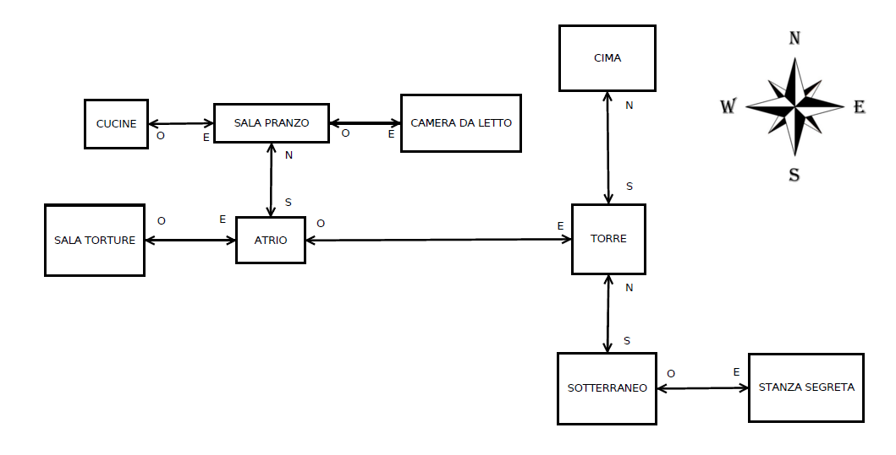

# **The Weird Castle**

**Relazione Progetto: "The Weird Caste" (gruppo: The Stonecuttes)**

**Membri gruppo: Marino Giuseppe, Mauro Alessandro, Cosimo Straniero**

## **TRAMA E CONSIDERAZIONI SUL GIOCO:**

Il gioco è stato pensato con la classica trama della fuga da un castello, tuttavia il punto di forza è dato dal grande numero di easter eggs e gag comiche al suo interno. Il titolo non vuole essere particolarmente difficile da completare e non presenta enigmi molto complessi proprio per renderlo veloce da finire in modo da passare un po' di tempo facendosi un po' di risate

Per rispecchiare l'idea alla base del gioco la mappa è di dimensioni contenute e non eccessivamente labirintica per evitare di creare confusione nel giocatore poiché per completare il gioco sarà necessario muoversi spesso tra le varie stanze.

La lettura di questo documento è da considerarsi parte integrante del gioco

### Trama
Ti risvegli un uno strano castello con la testa dolorante e la vista appannata,
non hai la minima idea di come tu ci sia finito lì dentro,
sai solo che a causa del grande mal di stomaco che hai in questo momento vorresti provare a scappare via,
tuttavia il ponte alle tue spalle è chiuso e ti impedisce di uscire,
ti toccherà esplorare il castello per trovare un modo per aprirlo.

SPOILER: Come completare il gioco

Per completare il gioco è necessario accedere alla sala del generatore per calare il ponte levatoio premendo il pulsante blu o il pulsante rosso
 
La sala del generatore si trova ad est del sotterraneo ed è necessario completare il minigioco del <i>ragno gigante</i> per potervi accedere
 
Il sotterraneo è molto buio e necessita di 3 candele per poter accedere al minigioco del ragno gigante
 
La parte principale del gameplay consiste nel trovare le 3 candele necessarie ad accedere al sotterraneo
 
Per poter prendere le candele bisogna avere la <i>magia del fuoco</i> che si ottiene parlando con il <i>vecchio saggio</i> nella sala torture
 
La sala torture è chiusa a chiave, la chiave si trova in un libro in cima alla torre
 
Dando del cibo al <i>vecchio saggio</i> è possibile ottenere degli indizi per completare il gioco
 
Le candele si trovano in <i>sala da pranzo</i>, <i>camera da letto</i> e <i>torre</i>
 
Ci sono in tutto 4 finali

 

#### Mappa

### **GAMEPLAY:**

Nel gioco ricopre un ruolo molto importante la ricerca di oggetti che possono essere ottenuti solo attraverso condizioni specifiche quali le interazioni con più oggetti diversi o il parlare con personaggi, senza aver trovato specifici oggetti sarà impossibile poter proseguire nella storia, tuttavia per poter recuperarne alcuni e soprattutto per accedere ad alcune stanze sarà necessario riuscire a trovare delle fonti di luce.

Data la semplicità del gioco vengono dati molti indizi durante il gioco per poter proseguire ma nel caso non si dovesse riuscire a capire che comando usare è sempre possibile chiedere aiuto al gioco stesso tramite il comando "help".

### **CONSIDERAZIONI TECNICHE:**

Queste considerazioni si sostituiscono al diagramma delle classi

#### Descrittore di gioco
Il gioco in sé è contenuto nella singola classe `WeirdCastel` che estende la classe `GameDescription` e contiene tutta la descrizione e la logica di gioco senza uso di forme di astrazione avanzate.
La classe astratta `GameDescription` ha due metodi astratti: `init` e `nextMove`
Nel metodo `init` è possibile specificare le varie stanze e relativi oggetti, i comandi di gioco e l'inventario di base.
Va **sempre** specificata la stanza iniziale tramite il metodo `setCurrentRoom` presente nella classe `GameDescription`, se si vuole fare un'avventura a singola stanza, ma che avventura sarebbe nel caso...

#### Motore di gioco
Il motore di gioco è definito nella classe `Engine` ed è pressocchè intoccato rispetto alla base fornita, fornisce il loop di gioco e, interfacciandosi con il `Parser`, gestisce l'input dei comandi di gioco da parte dell'utente

#### Parser
Il `Parser`, citando le parole del suo autore, *è implementato in modo abbastanza indipendente dalla lingua e riconosce solo frasi semplici del tipo \<comando\> [\<oggetto stanza\> [\<oggetto inventario\>]] non permette di utilizzare articoli o preposizioni*, ha subito tuttavia modifiche minori per accettare `comandi` e `oggetti` che contengono spazi nel nome (es: *pulsante rosso* e *pulsante verde*), viene usato esclusivamente dall'`Engine` nella fase di gestione input utente. Il parser è **case insensitive**

##### ParserOutput
Quando vi è un riscontro tra i comandi e gli oggetti disponibili (definiti nel descrittore di gioco) nell'input utente, il parser produce un `ParserOutput` che contiene informazioni riguardo il tipo del comando e gli oggetti specificati separati in oggetto stanza e oggetto inventario

##### Command
La classe `Command` descrive un comando che è definito a sua volta da:
- type - `CommandType`
- name - String
- alias - Set\<String\>

I comandi di gioco sono stabiliti dal *Descrittore di gioco* all'inizializzazione del gioco e vengono passati dal *Motore di gioco* al *Parser* ogni qualvolta necessita di gestire un input utente.
È possibile tuttavia aggiungere o rimuovere qualsiasi comando in qualsiasi momento qualora la logica di gioco lo necessiti

###### CommandType
La classe enumerativa `CommandType` enumera i possibili tipi di comandi che il gioco supporta.
Questa classe riduce il numero di comandi disponibili, una soluzione a questo problema è quella di delegare la creazione di un CommandType per gioco, usando un Generic, ma gli sviluppatori di questo gioco non si sono preoccupati poiché la lista di comandi fornita nella base era più che sufficiente ed è stata estesa solo per motivi politici

#### Oggetti di gioco
Gli oggetti di gioco sono descritte dalla classe `AdvObject` e dalle sottoclassi `AdvObjectContainer` ed `NPC`
Un gioco può sviluppare diversi tipi di oggetti estendendo la classe `AdvObject` (per quanto questo particolare gioco non ne faccia uso)

##### AdvObject
Un `AdvObject` è definito da
- id - int
- name - String
- description - String
- alias - Set\<String\>

ed ha i seguenti attributi booleani:
- openable - se l'oggetto si può `aprire`
- pickupable - se l'oggetto si può `raccogliere`
- pushable - se l'oggetto si può `premere`
- usable - se l'oggetto si può `usare`
- open - se l'oggetto è aperto
- push - se l'oggetto è premuto

###### AdvObjectContainer
Un `AdvObjectContainer` è un `AdvObject` con un attributo extra `list` che contiene altri `AdvObject`. Può essere usato per creare oggetti con un `inventario` <!--  si, questo è un easter egg -->

###### NPC
Un `NPC` è un `AdvObjectContainer` ed identifica un personaggio non giocabile, in quanto personaggio non può essere raccolto (a meno che non si vogliano vendere i suoi organi, ma vista la situazione moderna siamo rimasti politically correct)

#### Inventory
Un `inventario` è definito come una lista di `AdvObject`, in questa implementazione non è mai usato, prego ignorare questa utile classe

#### Room
Una `stanza` è definita dai seguenti attributi
- id - int
- name - String
- description - String
- look - String
- visible - boolean
- semivisible - boolean
- north - Room
- east - Room
- south - Room
- west - Room

Una mappa di gioco è composta da tante `stanze` che si collegano tra di loro nei quattro punti cardinali creando un grafo non orientato
Si noti che è possibile creare mappe in cui due stanze sono connesse tramite una sola via (es A -> B) o dove le stanze sono tutte connesse (A <-> B)
<!-- per quanto questo l'avrà fatto notare lo sviluppatore di tale classe quando l'ha presenta come esempio-->

#### Sviluppo
Lo sviluppo del gioco è stato diviso in 3 fasi
- Progettazione del mondo di gioco e della storia
- Sviluppo del gioco in Java
- Testing del gioco (schiavizzando amici e parenti)

##### Progettazione
Il mondo di gioco è stato progettato dai componenti **Alessandro Mauro** e **Cosimo Straniero** in collegamento tramite piattaforma Discord.
La progettazione si è divisa a sua volta in
- Scrittura della storia di base
- Creazione del mondo di gioco (stanze e contenuti)
- Interazioni col mondo di gioco e progressione

La progettazione ha richiesto circa una settimana di lavoro, con un tempo medio di 2 ore al giorno

##### Sviluppo e testing
Il gioco è stato sviluppato in Java dai componenti **Giuseppe Marino** e **Alessandro Mauro** facendo uso principalmente della casa del primo componente in quanto finita la quarantena da COVID-19.
 
Lo sviluppo del gioco è stato suddiviso a sua volta in 4 fasi:
- Creazione del mondo di gioco (stanze) e popolazione degli oggetti di gioco nelle varie stanze, movimento del giocatore nelle varie stanze
- Interazione col mondo di gioco (prendere oggetti, visibilità condizionale...) e con oggetti e personaggi presenti nel mondo di gioco (parlare con gli NPC, aprire oggetti contenitore...)
- Finale del gioco e varie GAG
- Testing del gioco e aggiunta di finali con variazioni

Lo sviluppo ha richiesto circa 5 giorni di lavoro, con un tempo medio di 2 ore al giorno

Durante lo sviluppo del gioco in Java parte della storia è stata modificata e parti ritenute superflue rimosse, allo stesso modo durante il testing del gioco il feedback ricevuto da parte delle cavie hanno portato a delle modifiche minori alla storia (laddove non erano chiare) e relativi bugfix

Durante tutte le fasi il tempo è stato diviso in maniera equa nelle seguenti sottofasi: cazzeggio, lavoro, revisione del lavoro, revisione del cazzeggio. Il cazzeggio potrebbe aver preso più tempo del previsto in tutte le fasi del lavoro.

## CONCLUSIONI E RIFLESSIONI:

### Riassunto

Il lavoro è stato svolto da un gruppo di 3 persone in costante collaborazione e comunicazione attraverso chiamate di gruppo tramite Discord, un gruppo su Telegram e un repository su github. A lavoro completato il gioco è stato fatto testare a diverse persone per avere pareri riguardo la storia, il gameplay e la presenza di eventuali errori che potrebbero essere sfuggiti (soprattutto in casi in cui doveva venire usato il comando help poiché, a differenza di altri, noi conoscevamo già tutti i comandi presenti nel gioco e le varie interazioni, quindi poteva capitare di non notare alcuni problemi con interazioni non fondamentali per il completamento della storia).

### Riflessioni

?

### Conclusioni
Questo lavoro è stato svolto in maniera del tutto professionale e sfruttando il tempo in maniera totalmente costruttiva come detto nei capitoli precedenti di questo testo.
